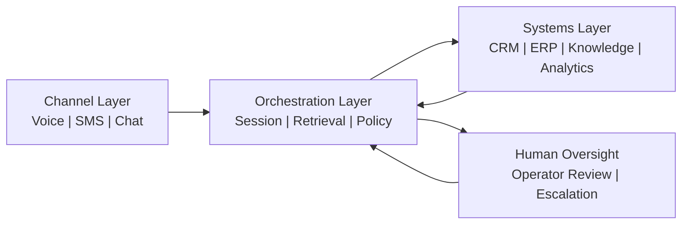

# Architecture

## Cross-Industry Compliance Layer Model

`enterprise-rag-patterns` implements a **four-layer defense-in-depth model**
for compliant RAG pipelines.  Each layer is independent — a bypass of one layer
does not compromise the others.

```
┌────────────────────────────────────────────────────────────────────────────┐
│  Layer 0: QUERY-TIME SECURITY (OWASP LLM01/LLM02)                         │
│  OWASPSensitiveDisclosureFilter · OWASPPromptInjectionScanner              │
│  PII redaction / injection detection before retrieval hits the LLM         │
└─────────────────────────────────────────┬──────────────────────────────────┘
                                          │ safe query
┌─────────────────────────────────────────▼──────────────────────────────────┐
│  Layer 1: IDENTITY SCOPING (FERPA / HIPAA)                                 │
│  FERPAContextPolicy · HIPAAContextPolicy · StudentIdentityScope             │
│  Namespace isolation (Pinecone) or metadata filter (Weaviate/Qdrant/Chroma)│
└─────────────────────────────────────────┬──────────────────────────────────┘
                                          │ scoped results
┌─────────────────────────────────────────▼──────────────────────────────────┐
│  Layer 2: COMPLIANCE FILTERING (GDPR / HIPAA / FERPA / SOC 2)              │
│  GDPRRAGPolicy · HIPAAContextPolicy.filter_retrieved_documents             │
│  FERPAContextPolicy.filter_retrieved_documents · SOC2ContextPolicy         │
└─────────────────────────────────────────┬──────────────────────────────────┘
                                          │ authorized documents
┌─────────────────────────────────────────▼──────────────────────────────────┐
│  Layer 3: RISK ASSESSMENT + AUDIT (NIST AI RMF / SOC 2 / HIPAA)            │
│  AIRMFRAGPolicy.assess_retrieval · HIPAAAuditRecord · AuditRecord          │
│  Structured JSON audit logs with SHA-256 tamper-evidence                   │
└────────────────────────────────────────────────────────────────────────────┘
                                          │ context + audit trail
                                          ▼
                                     LLM Synthesis
```

---

## Cross-Industry Compliance Coverage

| Regulation / Framework   | Module                        | Sector              | RAG Controls                              |
|--------------------------|-------------------------------|---------------------|-------------------------------------------|
| FERPA (34 CFR § 99)      | `compliance.py`               | Education           | Identity scoping, 34 CFR § 99.32 audit    |
| HIPAA (45 CFR § 164)     | `regulations/hipaa.py`        | Healthcare          | ePHI minimum-necessary, § 164.312(b) audit|
| GDPR (Articles 17, 32)   | `regulations/gdpr.py`         | EU / Global         | Right-to-erasure, data subject rights     |
| NIST AI RMF 1.0          | `regulations/nist_ai_rmf.py`  | All sectors         | MAP/MEASURE/MANAGE risk assessment        |
| OWASP LLM Top 10 (2025)  | `regulations/owasp_llm.py`    | Software / AI       | LLM01 injection, LLM02 PII disclosure     |
| SOC 2 Type II (AICPA)    | `regulations/soc2.py`         | SaaS / Enterprise   | Tenant isolation, CBAC, CC7.2 audit log   |

---

## Core layers



### 1. Channel layer

The channel layer handles voice, SMS, chat, or other inbound/outbound interaction surfaces.

Responsibilities:
- Transport integration
- Delivery and retry behavior
- Channel metadata capture

### 2. Orchestration layer

The orchestration layer manages:
- Session state (`SessionState`)
- Retrieval requests with compliance scoping
- Policy checks (`ActionPolicy`, `FERPAContextPolicy`)
- Action eligibility
- Escalation to humans when needed

### 3. Systems layer

The systems layer connects:
- CRM and case systems
- Document or verification systems
- Knowledge bases (Pinecone, Weaviate, Qdrant, ChromaDB)
- Analytics or warehouse layers

### 4. Compliance & Audit layer

Every retrieval event produces structured audit records:

- **FERPA**: `AuditRecord` — 34 CFR § 99.32 disclosure log
- **HIPAA**: `HIPAAAuditRecord` — 45 CFR § 164.312(b) access record with SHA-256 hash
- **NIST AI RMF**: `AIRMFRetrievalRisk` — MAP/MEASURE risk assessment record
- **OWASP**: `OWASPAuditRecord` — LLM01/LLM02 security event record

---

## Design Principles

1. **Pre-filter, not post-filter**: Identity scoping happens at the vector query
   layer, not in application code after retrieval. This is the FERPA §99.3 and
   HIPAA §164.502(b) minimum-necessary principle.

2. **Defense-in-depth**: Each compliance layer is independent. A bypass of the
   namespace isolation layer (Layer 1) does not bypass the metadata filter or
   the compliance filtering layer.

3. **Audit on every event**: Compliance audit records are emitted for every
   retrieval call, regardless of outcome. Audit sinks are caller-supplied
   callables — wire to your SIEM, database, or append-only log.

4. **No hard framework dependencies**: All framework integrations
   (LangChain, LlamaIndex, Haystack, CrewAI, MAF) use lazy imports. The
   core compliance modules have zero runtime dependencies.

5. **Regulation-portable**: Each regulation module uses the same `filter +
   audit_sink` pattern. Switch between FERPA, HIPAA, and GDPR controls
   by swapping the policy object — not the pipeline structure.

6. **Tamper-evident logging**: HIPAA and high-risk audit records include
   `content_hash()` (SHA-256). Store the hash in a separate immutable
   store to detect log tampering.

---

## Customisation Points

| Extension Point          | Interface                              | Example Use Case                         |
|--------------------------|----------------------------------------|------------------------------------------|
| Custom namespace resolver | `PineconeNamespaceIsolation(namespace_resolver=fn)` | Multi-tenant namespace mapping  |
| Custom audit sink         | `FERPAContextPolicy(audit_sink=fn)`   | Write to Kafka, BigQuery, Splunk         |
| Custom PII patterns       | `OWASPSensitiveDisclosureFilter(pii_patterns=[...])` | Domain-specific PII detection |
| Custom injection patterns | `OWASPPromptInjectionScanner(custom_patterns=[...])` | Sector-specific attack patterns |
| Custom PHI categories     | `HIPAAAccessScope(authorized_phi_categories={"lab_results"})` | Specialty clinic scope |
| Custom RMF data sources   | `AIRMFRAGPolicy(data_sources=["ehr", "pacs"])` | Healthcare system risk mapping |
| Custom SOC 2 TSC controls | `SOC2ContextPolicy(tsc_controls=["CC6.1", "C1.1"])` | Audit only CC6.1 + C1.1 |
| Custom confidentiality tiers | `SOC2ConfidentialityTier` subclass or label mapping | Non-standard data classification schemes |
