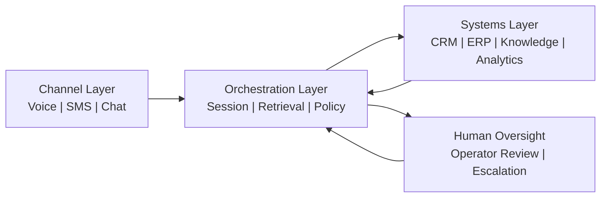

# Architecture Notes

## Core layers

### 1. Channel layer

The channel layer handles voice, SMS, chat, or other inbound / outbound interaction surfaces.

Responsibilities:
- transport integration
- delivery and retry behavior
- channel metadata capture

### 2. Orchestration layer

The orchestration layer manages:
- session state
- retrieval requests
- policy checks
- action eligibility
- escalation to humans when needed

### 3. Systems layer

The systems layer connects:
- CRM and case systems
- document or verification systems
- knowledge bases
- analytics or warehouse layers

## Design principles

- context should be assembled, not guessed
- memory should be scoped and inspectable
- actions should be policy-bound
- handoff should be explicit, not accidental
- channel continuity should preserve user progress
